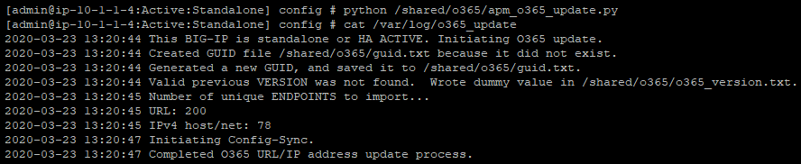

# BIG-IP APM Split Tunneling & Dynamic Exclusion of Office 365 (O365) URLs/IPs

This script fetches Office 365 URLs and IPs (IPv4 and/or IPv6) from Microsoft's [Office 365 IP Address and URL web service](https://docs.microsoft.com/en-us/office365/enterprise/office-365-ip-web-service), dynamically updates Network Access List "Exclude" properties for one or more Network Access Lists, and applies changes to the affected Access Policies. If the script is running on an HA pair of BIG-IPs then the script will also initiate a ConfigSync to push the updated configuration from the active BIG-IP to the standby BIG-IP.

## Script Requirements
*	TMOS 12.1.0 or higher
*	BIG-IP must be capable of resolving internet DNS names (ex. via DNS Lookup Server configuration)
*	BIG-IP must be able to reach endpoints.office.com via TCP 443 (via Management or TMM interface)
* Administrative rights on the BIG-IP(s)
* Bash shell access on the BIG-IP(s)

## Things to Note
*	This script does not enable “split tunneling” or make any other modifications, other than those mentioned, to the Network Access List(s) that may be required to enable the desired functionality. For guidance relating to Network Access List / Split Tunnelling configuration refer to the [BIG-IP APM Knowledge Center](https://support.f5.com/csp/knowledge-center/software/BIG-IP?module=BIG-IP%20APM).
  * Some split tunneling guidance:
    * *Allow Local DNS Servers* should be enabled to allow client access to Office 365 when VPN is disconnected
    * DNS Exclude Address Space is not supported on macOS
    * IPV6 Exclude Address Space doesn't currently work on macOS
* This script should not be used with BIG-IP Edge Client's Always Connected Mode: if Stonewall is configured to block traffic, then the excluded resources are not reachable (this is by design).
* This script tracks the version of the Office 365 service instance and will only update the exclusion lists if a newer version is detected. If modifications to the script's operating parameters (ex. Network Access Lists, O365 Service Areas, Additional URLs/IPs to Exclude) are made, they will NOT take effect until the script detects a new service instance version. To force the script to run with the updated parameters earlier, remove the o365_version.txt file from the script's working directory OR *temporarily* set `force_o365_record_refresh = 1`, then manually execute the script (`python /shared/o365/apm_o365_update.py`).
* This script *overwrites the contents* of the following fields in the defined Network Access Lists when an update is detected:
  * If "use_url" is set to 1: DNS Exclude Address Space
  * If "use_ipv4" is set to 1: IPV4 Exclude Address Space
  * If "use_ipv6" is set to 1: IPV6 Exclude Address Space
* The aforementioned fields / properties should not be managed via TMSH or the GUI after implementing this script as the script will overwrite any manual changes to these fields when it detects the next Office 365 service instance update. To add non-Office 365 URLs/IPs to or remove any URL/IP (Office 365 or otherwise) from the "Exclude Address Space" properties of the Network Access Lists, use the noimport_\* and additional_\* fields in the script (see User Options in the Appendix for usage details) . Be sure to apply these changes to both units of an HA pair!
* Usage of DNS Address Exclusions requires the installation of the DNS Relay Proxy service on the VPN client
  * [K9694: Overview of the Windows DNS Relay Proxy service](https://support.f5.com/csp/article/K9694)
  * [K49720803: BIG-IP Edge Client operations guide | Chapter 3: Common approaches to configuring VPN](https://support.f5.com/csp/article/K49720803)
* While the endpoints retrieved by this script handle the vast majority of Office 365 traffic, it is possible some traffic related to Office 365 is not summarized in the endpoint lists and will still go through the VPN.
* HA: This script must be implemented on both members of an HA pair
* HA: Updates made to the Python script are NOT synchronized between peers - updates must be made manually to each instance of the Python script
* HA: Exclusion list updates will only take place on the Active member - changes are synced from the Active to Standby by the script
* This script relies on iCall to periodically run. See [What is iCall?](https://devcentral.f5.com/s/articles/what-is-icall-27404) on DevCentral for an overview of iCall. iCall [scripts](https://clouddocs.f5.com/cli/tmsh-reference/latest/modules/sys/sys_icall_script.html) and [periodic handlers](https://clouddocs.f5.com/cli/tmsh-reference/latest/modules/sys/sys_icall_handler_periodic.html) are documented in greater detail in the [F5 TMSH Reference](https://clouddocs.f5.com/cli/tmsh-reference/latest/).
  
## Implementation

1. Modify the "User Options" in the script to match your environment and requirements
2. SSH to the standalone or active BIG-IP
3. Change to the bash shell  
  `bash`
4. Create the directory the script will reside in. The default directory is /shared/o365/.  
  `mkdir /shared/o365`  
  *Note: If not creating the directory as it is above, ensure you update the variables under **System Options** with the correct path.*
5. Upload or create the script (apm_o365_update.py) in the working directory (default path: /shared/o365/)
6. Manually run the script  
  `python /shared/o365/apm_o365_update.py`
7. Confirm the script ran without error by displaying the log file (default path: /var/log/o365_update):  
  `cat /var/log/o365_update`
  
    
    
    Confirm the appropriate fields are populated in the relevant Network Access Lists:
    
    
    
    Confirm the appropriate Access Profiles/Per-Session Policies have been applied/committed (green flag).
    
    ")
8. If this is an HA pair, repeat steps 2 - 7. Note, it is normal for the Standby BIG-IP to log the following message when the update script is run:  
 `This BIG-IP is HA STANDBY. Aborting O365 update.`
9. On the Active BIG-IP, create an iCall script. This script executes the apm_o365_update.py script when it is called by an iCall handler, which we will create in the next step. Ensure the correct path to the script is referenced, in case defaults were not used.  
 `tmsh create sys icall script o365_update_script definition { catch { exec python /shared/o365/apm_o365_update.py } }`
10. On the Active BIG-IP, create an iCall handler. This handler will run at the configured interval and will execute the iCall script, which in turn executes the apm_o365_update.py Python script. A few examples of periodic handlers are given, choose (and adapt) the one that suits your needs best.  

    Run once every 60 minutes (3600 seconds), starting now:  
    `tmsh create sys icall handler periodic o365_update_handler script o365_update_script interval 3600`  
 
    Run once every 24 hours (86400 seconds), starting on March 20, 2020 at 03:00:  
    `tmsh create sys icall handler periodic o365_update_handler script o365_update_script interval 86400 first-occurrence 2020-03-20:03:00:00`

11. On the Active BIG-IP, save changes:  
  `tmsh save sys config`
12. Synchronize changes from the Active BIG-IP to the Standby BIG-IP

This concludes the steps required to install this script.

## Appendix

### User Options
* **na_lists** - Specify the Network Access Lists that this script will load the Office 365 URLs/IPs into.
  * *Usage examples:*
    * Single Network Access List: na_lists = ["MyNAL"]
    * Multiple Network Access Lists: na_lists = ["MyNAL1", "MyNAL2", "MyNAL3"] (comma separated)
* **access_profiles** - Specify the Access Profiles/Policies that this script will apply after updating the Network Access Lists defined in **na_lists**. The script will execute the "Apply Access Policy" action on the Access Profiles defined in this list.
  * *Usage examples:*
    * Single Access Profile: access_profiles = ["MyAP"]
    * Multiple Access Profiles: access_profiles = ["MyAP1", "MyAP2", "MyAP3"] (comma separated)
* **customer_endpoint** - Specify the Office 365 instance to return endpoints for.
  * *Default:* Worldwide
  * *Usage example:*
    * Uncomment the desired endpoint. Only one endpoint is supported. For example, to specify the Worldwide endpoint remove the "#" at the beginning of that line:  
        
      customer_endpoint = "Worldwide"  
      #customer_endpoint = "USGovDoD"  
      #customer_endpoint = "USGovGCCHigh"  
      #customer_endpoint = "China"  
      #customer_endpoint = "Germany"
* **care_exchange** - Specify whether to import endpoints from the Exchange service area.
  * *Default:* 1
  * *Options:*
    * 0 - Do not import endpoints from this service area
    * 1 - Import endpoints from this service area
  * *Usage example:*
    * care_exchange = 1 (import Exchange endpoints)
* **care_sharepoint** - Specify whether to import endpoints from the SharePoint service area.
  * *Default:* 1
  * *Options:*
    * 0 - Do not import endpoints from this service area
    * 1 - Import endpoints from this service area
  * *Usage example:*
    * care_sharepoint = 0 (do not import SharePoint endpoints)
* **care_skype** - Specify whether to import endpoints from the Skype service area.
  * *Default:* 1
  * *Options:*
    * 0 - Do not import endpoints from this service area
    * 1 - Import endpoints from this service area
  * *Usage example:*
    * care_skype = 1 (import Skype endpoints)
* **care_common** - Specify whether to import endpoints from the Common service area.
  * *Default:* 1
  * *Options:*
    * 0 - Do not import endpoints from this service area
    * 1 - Import endpoints from this service area
  * *Usage example:*
    * care_common = 1 (import Common endpoints)
* **use_url** - Specify whether to import Office 365 URLs (populates DNS Exclude Address Space).
  * *Default:* 1
  * *Options:*
    * 0 - Don't import URLs
    * 1 - Import URLs
  * *Usage:*
    * use_url = 1
* **use_ipv4** - Specify whether to import Office 365 IPv4 addresses (populates IPV4 Exclude Address Space).
  * *Default:* 1
  * *Options:*
    * 0 - Don't import IPv4 addresses
    * 1 - Import IPv4 addresses
  * *Usage:*
    * use_ipv4 = 1
* **use_ipv6** - Specify whether to import Office 365 IPv6 addresses (populates IPV6 Exclude Address Space).
  * *Default:* 1
  * *Options:*
    * 0 - Don't import IPv6 addresses
    * 1 - Import IPv6 addresses
  * *Usage:*
    * use_ipv6 = 1
* **only_required** - Specify whether to only import O365 "required" endpoints or to import all endpoints. WARNING: Importing all endpoints will result in the importation of non-O365 URLs that one may not want to bypass (ex. www.youtube.com)
  * *Default:* 1
  * *Options:*
    * 0 - Import all endpoints
    * 1 - Import only "required" endpoints
  * *Usage:*
    * only_required = 1
* **additional_urls** - Specify non-Office 365 URLs to add to the DNS Exclude Address Space. *This field only applies if use_url = 1.*
  * *Usage:*
    * Single URL: additional_urls = [".facebook.com"]
    * Multiple URLs: additional_urls = [".facebook.com", "*.itunes.apple.com", "bit.ly"] (comma separated)
* **additional_ipv4** - Specify non-Office 365 IPv4 addresses to add to the IPV4 Exclude Address Space. *This field only applies if use_ipv4 = 1.*
  * *Usage:*
    * Single IP: additional_ipv4 = ["191.234.140.0/22"]
    * Multiple IPs: additional_ipv4 = ["191.234.140.0/22", "131.253.33.215/32"] (comma separated)
* **additional_ipv6** - Specify non-Office 365 IPv6 addresses to add to the IPV6 Exclude Address Space. *This field only applies if use_ipv6 = 1.*
  * *Usage:*
    * Single IP: additional_ipv6 = ["2603:1096:400::/40"]
    * Multiple IPs: additional_ipv6 = ["2603:1096:400::/40", "2620:1ec:a92::152/128"] (comma separated)
* **noimport_urls** - Specify URLs that you do not wish to import. URL must be exact match or ends_with match to URL as it exists in O365 JSON record (pattern matching is not supported). *This field only applies if use_url = 1.*
  * *Usage:*
    * Single URL: noimport_urls = [".facebook.com"]
    * Multiple URLs: noimport_urls = [".facebook.com", "*.itunes.apple.com", "bit.ly"] (comma separated)
* **noimport_ips** - Specify IPs (IPv4 and/or IPv6) that you do not wish to import. IP must be exact match to IP as it exists in O365 JSON record (IP/CIDR mask cannot be modified). *This field only applies if use_ipv4 = 1 or use_ipv6 = 1.*
  * *Usage:*
    * Single IP: noimport_ips = ["191.234.140.0/22"]
    * Multiple IPs: noimport_ips = ["191.234.140.0/22", "2620:1ec:a92::152/128"] (comma separated)
* **force_o365_record_refresh** - Specify whether to force a record refresh on each run. This will refresh all Office 365 endpoints as well as apply the most recent additional_\* and noimport_\* URLs/IPs.
  * *Default:* 0
  * *Options:*
    * 0 - Only refresh when new Office 365 service instance version is detected
    * 1 - Force refresh
  * *Usage:*
    * force_o365_record_refresh = 0 (do not force refresh)
* **ha_config** - Specify whether this BIG-IP is in a high-availability (HA) pair or standalone.
  * *Default:* 0
  * *Options:*
    * 0 - Standalone
    * 1 - In HA pair
  * *Usage:*
    * ha_config = 1 (in HA pair)
* **device_group_name** - Specify the name of the sync-group the Network Access Lists reside in (typically the Sync-Failover device group). This field can be ignored if ha_config is set to 0 (i.e. if the BIG-IP is standalone).
  * *Usage:*
    * device_group_name = "Sync-Failover-Group"
* **log_level** - Specify the logging level of the script. Log messages are written to the file specified in **log_dest_file**.
  * *Default:* 1
  * *Options:*
    * 0 - No logging
    * 1 - Normal level of logging
    * 2 - Debug level logging
  * *Usage example:*
    * log_level = 1 (normal logging)
